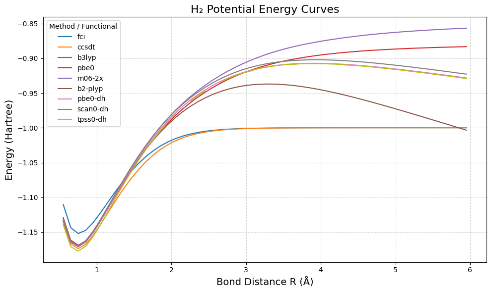

# h2_dissociation_crap
A descent into madness in the dissociation of H2 

## GAMESS build info 

GAMESS built with intel LLVM compilers 25.0.4 using intel-mkl and intel-mpi from that distribution. No OpenMP was enabled in this build, pure MPI GAMESS.  

You have to build GAMESS with libxc to use the input files provided here.

## result

